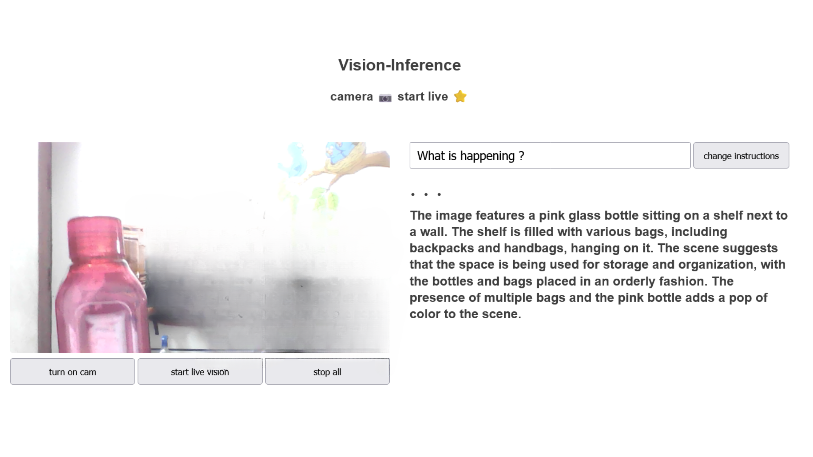

🪶Check out the configuration reference at https://huggingface.co/docs/hub/spaces-config-reference

🚀Huggingface space : https://huggingface.co/spaces/prithivMLmods/Vision-Inference

🚀To Clone Just Install Git Past the Command : git clone https://huggingface.co/spaces/prithivMLmods/Vision-Inference

## 📂➡️ Source and Target Live Image for Processing, Inference Results👉

.

.

.
